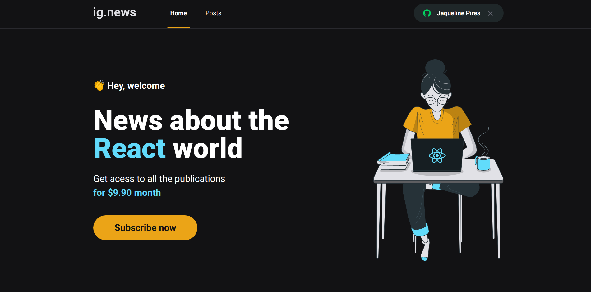
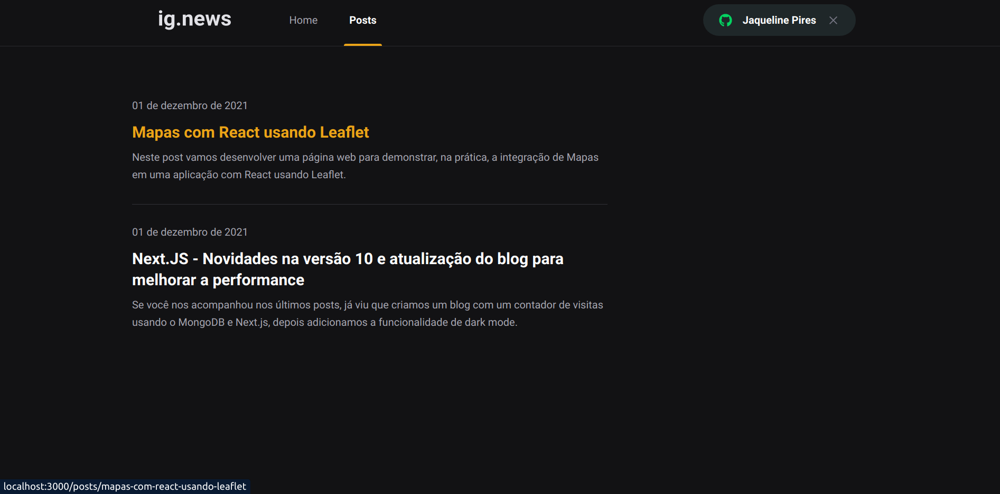
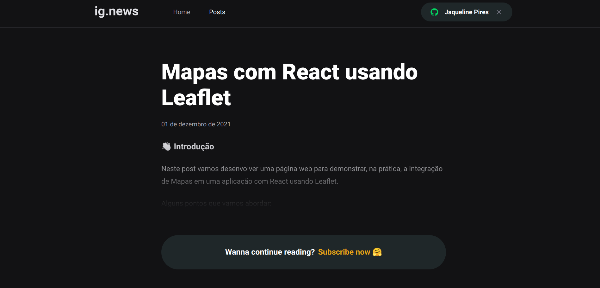

<h1 align="center">
  
</h1>

<p align="center">Aplicação para inscrição de newsletter com pagamento via stripe</p>

## ig.news

Aplicação em NextJS para listagem de posts e sistema de inscrição (subscription).

A aplicação foi desenvolvida utilizando o framework NextJS aplicando conceitos como consumo de API externas, API Root, Server Side Rendering (SSR), Static Site Generation (SSG), STRIPE para pagamentos das subscriptions, NextAuth para autenticação com Github, FaunaDB para armazenar as informações do usuário em um banco de dados e Prismic CMS para adição e gerenciamento do conteúdo dos posts.

---

<h1 align="center">
  
  
  
</h1>

---

## Tecnologias

- [ReactJS](https://reactjs.org/)
- [NextJS](https://nextjs.org/)
- [TypeScript](https://www.typescriptlang.org/)
- [SASS](https://sass-lang.com/)
- [Next-Auth](https://next-auth.js.org/)
- [Stripe](https://stripe.com/)
- [FaunaDB](https://fauna.com/)
- [Prismic CMS](https://prismic.io/)

---

### **Iniciando o projeto**

```bash
# Execute yarn para instalar as dependências
$ yarn

# Na raiz do projeto crie uma copia do arquivo .env.local.example
# Altere o nome da copia para .env.local
# Preencha as variáveis ambiente de acordo com as instruções
$ cp .env.local.example .env.local

# Execute stripe listen para ouvir eventos do webhook
$ stripe listen --forward-to localhost:3000/api/webhooks

# Para iniciar a aplicação
$ yarn dev

```

---

Feito com 💙 por [Jaqueline Pires](https://www.linkedin.com/in/jaqueline-pires)
